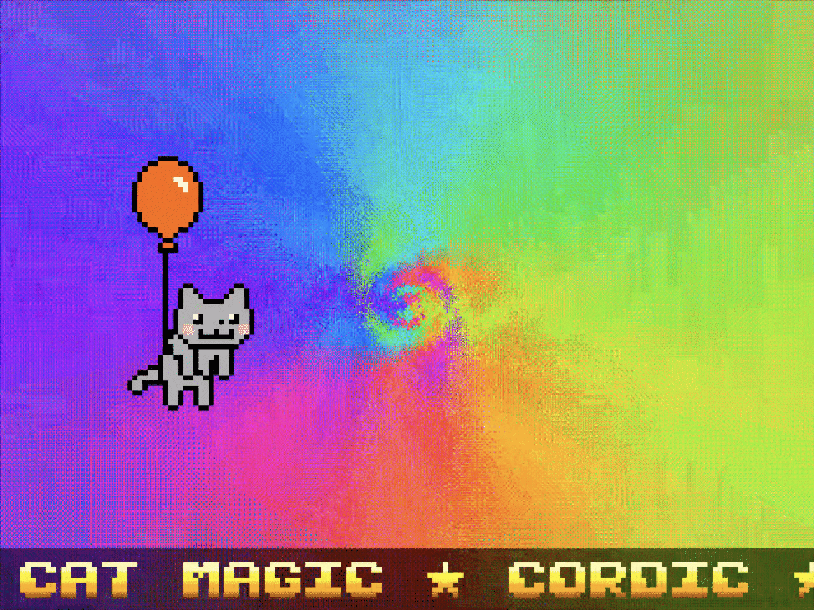

# Journey — TTSKY26a Demoscene Entry

Dark tunnels and a cat on a red balloon casting spells, bringing colors and joy, with chiptune music and scrolling text — all in just two Tiny Tapeout tiles and 2743 logic cells.

- [Project datasheet](docs/info.md)
- [TTSKY26a Demoscene competition](https://tinytapeout.com/competitions/demoscene-ttsky26a-announce/)

[Watch on YouTube](https://www.youtube.com/watch?v=p8H18U0VVHA)

## Try it before silicon

- **Tang Primer 20K + Dock**: full speed, real VGA + audio.
  `make fpga` synthesizes and flashes.
- **Verilator + SDL**: `make sim` opens a window. The GUI runs at
  ~32 fps on a typical laptop instead of the intended 60, so motion
  looks half-speed; useful for development, not for a real
  impression.
- **Verilator → MP4**: `make record` renders a true-60 fps capture
  to disk. Best way to see the demo if you don't have an FPGA.

## What is Tiny Tapeout?

Tiny Tapeout is an educational project that makes it easier and cheaper
than ever to get your digital and analog designs manufactured on a real
chip. Learn more at <https://tinytapeout.com>.

Built from the [ttsky-verilog-template](https://github.com/TinyTapeout/ttsky-verilog-template).
